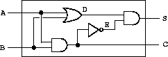

## 项目简介
+ 项目是[sicp](https://mitpress.mit.edu/sites/default/files/sicp/full-text/book/book-Z-H-23.html "")上的一个demo
+ 使用java实现数字电路模拟程序
## 设计思路

+ 数字电路的计算模型
  + 导线：接收和传输数字信号。
  + 门器件(与门、或门、非门):作用类似于函数，接收输入导线的数字信号，经过逻辑计算，将计算结果置于输出导线的数字信号中。
+ 半加器
  > 半加器电路是指对两个输入数据位相加，输出一个结果位和进位，没有进位输入的加法器电路。 是实现两个一位二进制数的加法运算电路。
  + &nbsp;
  + 输入导线：A、B
  + 输出导线：S、C
+ 半加器-传统实现方式
  + 我们将半加器看作是一个函数，可以很容易的给出这个函数的定义
  ```
  Pair<Bit, Bit> halfAdder(Bit A, Bit B); //Bit只允许值为0或1
  ```
  + 我们可以写出半加器函数的内部流程，
      ```
      C = and-gate(A, B);
      S = and-gate(or-gate(A, B), inverter(and-gate(A, B)));
      ```
  + 与门、或门、非门的实现也非常简单，
      ```
      //与门
      Bit and-gate(Bit A, Bit B) {
          return A.value & B.value;
      }
      //或门
      Bit or-gate(Bit A, Bit B) {
          return A.value | B.value;
      }
      //非门
      Bit inverter(Bit A) {
          return A.value == 1 ? 0 : 1;
      }
      ```
   + 到这里，我们基本就用程序实现了半加器。这个也是我一开始所想到的实现方式，接下来将分析一下基于事件驱动实现的半加器。
